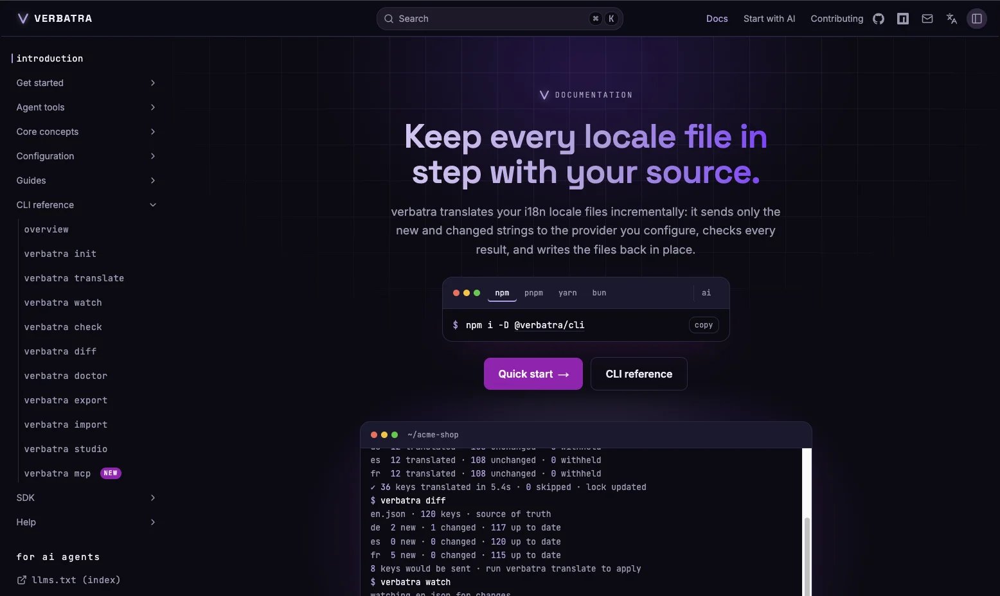

<p align="center">
  
</p>

<h1 align="center">verbatra</h1>

<p align="center">
  Automate i18n translation: only what changed gets translated, and nothing that breaks a placeholder gets written.
</p>

<p align="center">
  <a href="https://www.npmjs.com/package/@verbatra/cli"></a>
  <a href="https://www.npmjs.com/package/@verbatra/sdk"></a>
  <a href="https://nodejs.org"></a>
  <a href="https://github.com/verbatra/verbatra/actions/workflows/ci.yml"></a>
  <a href="https://codecov.io/gh/verbatra/verbatra"></a>
  <a href="./LICENSE"></a>
</p>

## Quick start

Needs Node.js `>=22.14.0`.

```bash
# 1. Install as a dev dependency
npm install --save-dev @verbatra/cli

# 2. Scaffold verbatra.config.ts and .env.example (choose your provider)
npx verbatra init --provider gemini

# 3. Provide the provider's API key, in .env or exported (Gemini shown)
export GEMINI_API_KEY=your-key-here

# 4. Translate every target locale once
npx verbatra translate
```

A dev-dependency install puts the `verbatra` binary in `node_modules/.bin` rather than on your PATH, so the commands above call it through `npx`, which runs the locally installed binary whichever package manager put it there. Gemini is the cheapest way to try verbatra, because its API has a real free tier: create a key at [Google AI Studio](https://aistudio.google.com/apikey) with no billing setup. Pass `anthropic`, `openai`, `deepl`, or `google-translate` to `--provider` instead if you prefer one of those. pnpm users need one extra step before installing; see [Troubleshooting](https://verbatra.kreitz-webdev.de/docs/troubleshooting).

## Description

verbatra translates your application's locale files for you. You maintain the source locale by hand, and as strings are added or change, verbatra fills in every target locale through the AI or machine-translation provider you choose. A lock file, `verbatra.lock.json`, records the content hash of every string it has already translated, so each run diffs your source against that baseline and sends only the genuinely new or changed keys to the provider. Nothing is re-translated because a file was reformatted or a sibling key moved.

The part that matters when a run goes wrong is the integrity gate. Every candidate value, whether it came from a provider, a filled translator workbook, a TMX import, a manual edit in Studio, or a reused cache hit, is re-checked from the value itself at the single accept point every write path calls. A value that drops or renames a placeholder, breaks inline markup, fails to parse as ICU, or comes back empty or degenerate is withheld and reported instead of written, and the previous translation stays intact. A broken translation does not reach your locale files and does not reach your lock file.

## Features

- **Fourteen locale formats.** JSON for i18next, vue-i18n, next-intl, and ngx-translate, plus XLIFF, YAML, Flutter ARB, Java/Spring `.properties`, Apple `.strings`/`.stringsdict`, Xcode String Catalogs, Android `strings.xml`, gettext `.po`/`.pot`, INI, and .NET `.resx`.
- **Six providers behind one interface.** Anthropic, OpenAI, Gemini, and any openai-compatible local or self-hosted server as LLMs, plus DeepL and Google Cloud Translation as machine translation.
- **Incremental by default.** The lock file makes every run diff-driven, so a run over an unchanged project calls no provider at all.
- **Read-only CI gates.** `verbatra check`, `diff`, and `doctor` call no provider, need no API key, write no file, and exit non-zero on drift.
- **Manual translation handoff.** Export the strings that need a human into an Excel workbook, CSV, or TSV, import the filled file back through the same integrity gate, and move the whole memory in or out as TMX.
- **Source-code extraction.** `verbatra extract` finds translation call sites in your application source and adds the new keys to the source locale; `diff --unused` names the keys nothing references any more.
- **Spend before you spend.** `--dry-run` and `--estimate` preview a run without calling a provider, and `verbatra pseudo` builds a pseudolocale that exposes truncated layouts before you have a key at all.
- **Keys stay in your environment.** API keys are read only from environment variables, never from a config file, a CLI argument, or a function argument.

## What ships today

| Package | Version | What it is |
| --- | --- | --- |
| [`@verbatra/cli`](https://www.npmjs.com/package/@verbatra/cli) |  | The `verbatra` binary for your terminal and CI. [Docs](https://verbatra.kreitz-webdev.de/docs/cli) |
| [`@verbatra/sdk`](https://www.npmjs.com/package/@verbatra/sdk) |  | The same engine as a programmatic API; the CLI is a thin wrapper over it. [Docs](https://verbatra.kreitz-webdev.de/docs/sdk) |
| [`@verbatra/studio`](https://www.npmjs.com/package/@verbatra/studio) |  | Verbatra Studio, the local dashboard served by `verbatra studio`. [Docs](https://verbatra.kreitz-webdev.de/docs/cli/studio) |
| [`@verbatra/mcp`](https://www.npmjs.com/package/@verbatra/mcp) |  | A stdio MCP server exposing verbatra's tools to an MCP client. [Docs](https://verbatra.kreitz-webdev.de/docs/cli/mcp) |
| [`verbatra/action`](https://github.com/verbatra/action) |  | A composite GitHub Action; consumed with `uses:`, not installed from npm. [Docs](https://verbatra.kreitz-webdev.de/docs/github-action) |

Three agent skill documents in [`skills/`](./skills) teach a coding agent which of these surfaces to reach for; install one with `npx skills@latest add verbatra/verbatra --skill verbatra-cli -y`.

## Formats and providers

Formats are a closed set of fourteen, each registered by an adapter that round-trips the file in its own document key order rather than rewriting it. See [Formats](https://verbatra.kreitz-webdev.de/docs/formats) for the list and what each adapter preserves.

Providers are a closed set of six behind one narrow interface, four LLM and two machine translation, selected by a single `id` in your config. See [Providers](https://verbatra.kreitz-webdev.de/docs/providers) for each one's options, model ids, and key variable.

A format or provider verbatra does not ship can be added from outside: the SDK re-exports the adapter factories and accepts a registry of your own. See [`.claude/rules/architecture.md`](./.claude/rules/architecture.md).

## Studio

`verbatra studio` starts Verbatra Studio, a local web dashboard over your project with four pages: translation status and diff, a needs-review queue with in-place editing, a live locale-file activity feed with the last run's token usage, and the resolved config with an editable glossary. Every page refreshes live as your locale files change.

The server binds to `127.0.0.1` only and authenticates every request. Local editing is always on and runs through the same integrity gate a translate run applies. Actions that spend provider budget exist only when you start Studio with `--allow-spend`; without that flag, Studio never calls a provider.

```bash
npm install --save-dev @verbatra/cli @verbatra/studio
npx verbatra studio
```

## GitHub Action

A composite GitHub Action runs verbatra in CI, turns each failed locale into an error annotation, writes a job summary table, and exits with the CLI's own exit code. Its `command` input selects `translate`, `check`, or `diff`, so the read-only gate runs in CI too: `check` and `diff` call no provider and need no API key, which makes them safe on a fork pull request.

It lives in its own repository, [verbatra/action](https://github.com/verbatra/action), and is consumed with `uses:` rather than installed from npm. See the [GitHub Action page](https://verbatra.kreitz-webdev.de/docs/github-action) for the input list and the security notes.

## Security

API keys are read only from environment variables, never from the config file, a CLI argument, or a function argument. The config schema rejects unknown keys, so a key cannot hide there by accident, and error messages name the variable a provider needs without ever including its value.

`verbatra init` adds the local files a verbatra project must not commit to your `.gitignore`, `.env` and `.env.local` among them, and later runs top up an existing `.gitignore` that is missing one.

To report a vulnerability, see [SECURITY.md](./SECURITY.md).

## Documentation

**[verbatra.kreitz-webdev.de](https://verbatra.kreitz-webdev.de)** is the canonical reference: every command, every config key, every format, and every provider. At the terminal, `verbatra <command> --help` prints the same command reference.



## Contributing

Contributions are welcome; please read [CONTRIBUTING.md](./CONTRIBUTING.md) and the [Code of Conduct](./CODE_OF_CONDUCT.md) first.

## License

[MIT](./LICENSE) (c) Mario Kreitz
